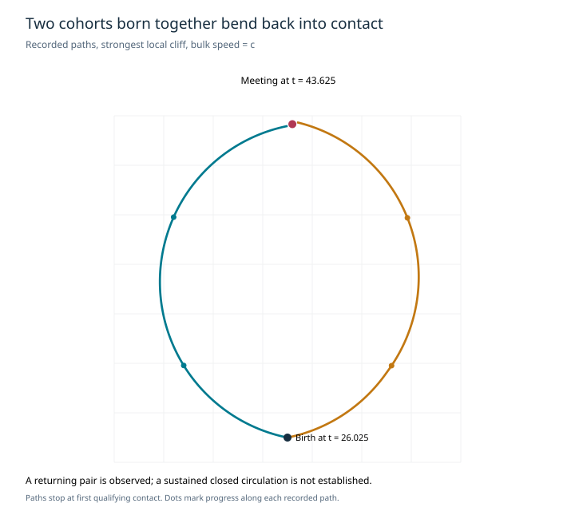

# Geometry recruitment — final findings

15 September 2026 · Experimental version 0.2.0

**The local lab is ready to inspect. Some cohorts born together bend back into contact. Sustained two-branch circulation around a small conversion region is still unestablished.** The experiment set is complete for this iteration; no further sweep is needed to use the deliverable.

## What changed

The inherited-direction hypothesis recruits each next supplier along its predecessor's axis. This favors straight advancing birth tracks by construction. Two alternatives now select from the current eight local donor–gap–receiver directions:

- **Strongest local cliff:** recruit along the greatest eligible current contrast per distance. Exact ties divide the released amplitude equally.
- **Distributed local cliffs:** divide that same amplitude across all eligible directions, weighted by contrast per distance.

Both retain the physical transit delay, recorded birth-to-supplier provenance and the release-amplitude budget. Neither fixes an exit count or prescribes a loop. They remain provisional rules, and multiple arriving signals are processed sequentially; grid orientation and ordering effects are unresolved.

The default lab now uses strongest-local-cliff recruitment and the original forward-probe steering comparison. All previous choices remain available. Bulk cohort speed is independently adjustable from 0.4 c to 2 c, following the user's clarification; the comparison below covers 0.6 c, c and 1.4 c.

## What the completed comparison shows

The 21 cases used an 80 × 64 domain, dt = 0.025 and ran to t = 120. Nine compare recruitment and bulk speed; the others shift the initial dip or disable wake pickup, steering or export.

| Recruitment | Bulk speed | Birth events | Birth extent | Returning same-birth pairs | Individual near-origin returns |
| --- | ---: | ---: | ---: | ---: | ---: |
| inherited | 0.6 c | 152 | 22.00 | 0 | 0 |
| inherited | 1.0 c | 152 | 22.00 | 0 | 0 |
| inherited | 1.4 c | 152 | 22.00 | 0 | 0 |
| strongest | 0.6 c | 161 | 17.49 | 2 | 3 |
| strongest | 1.0 c | 181 | 19.42 | 2 | 2 |
| strongest | 1.4 c | 178 | 17.00 | 0 | 1 |
| distributed | 0.6 c | 22 | 2.83 | 1 | 7 |
| distributed | 1.0 c | 24 | 2.83 | 0 | 0 |
| distributed | 1.4 c | 24 | 2.83 | 0 | 0 |

“Returning same-birth pairs” counts unique cohort pairs, not repeated collision time steps. Both cohorts must have travelled more than 8 length units, accumulated more than a quarter-turn and then met while approaching with sufficient opposition. “Individual near-origin returns” requires travelling beyond radius 4 from the cohort's own birth point and later entering radius 2, after more than 8 travelled units and a quarter-turn. These are diagnostic screens, not a proof of a complete circulation mechanism.

Strongest-cliff recruitment changes direction 56, 63 and 61 times at speeds 0.6 c, c and 1.4 c respectively. At c, two unique same-birth pairs pass the return-contact screen. The plotted example shows cohorts 85 and 86 from birth event 84, born at (39, 35), meeting near (39.20, 22.34) at t = 43.625. Each travelled about 17.625 length units and turned about 2.7 radians. That contact returned approximately 0.263 content units, including carried wake content. It happens roughly 12.7 units from their birth point, so this is a pair bending back into each other, not a closed orbit returning to the source.

Distributed recruitment stays within about 2.83 length units of the original dip in the centered runs, but produces no new births after t = 19.425. At the slower bulk speed it produces returning paths and one same-birth meeting pair; formation has already stopped. Strongest-cliff recruitment keeps producing cohorts but its birth region spreads. Its slower run has nine late births within radius 5, which is insufficient evidence of a persistent compact process.

The controls still matter. Disabling export eliminates feedback births. Disabling steering eliminates the curved-contact screen. A same-birth curved contact also occurs with wake pickup disabled, so wake carving is not established as necessary in this model. Shifting the initial dip changes results substantially. The inherited shifted case itself produces one returning same-birth pair; geometry recruitment is therefore not uniquely responsible for every such contact.

## Limits and handoff

The explicit release signal, angular release rule, dense receiving resistance and damped AM response remain hypotheses. Inherited axial advance at 0.2 c comes from the selected timing structure. A chosen bulk speed is a parameter, not a derived prediction. The current evidence does not establish invariant kickback, grid-independent behavior, or a sustained O-like engine.

All **19 implementation checks passed**. The largest sampled content-account error in the geometry comparison was 4.37e-11 baseline-cell units. These checks establish accounting and the declared event mechanics, not physical validity.

Open the [online lab](https://virtualorganics.github.io/adaptive-medium-lab/), choose the recruitment rule and bulk speed, and press **Restart with these settings**. Summary measurements and figures are included here. The complete trace archives, source references and previous revision remain in the original local research workspace. Use the included experiment scripts to regenerate full traces locally.
